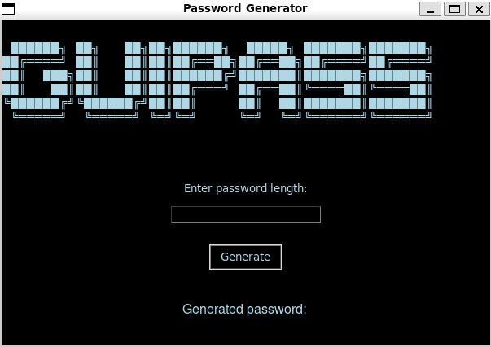

# ABOUT

~ This is `version 2.0.0` of repository `passgenerator` that has been upgraded with a lot more functions and new enviroment!
------
# REQUIREMENTS

~ `Python3`

~ `Git`

~ `Linux GUI enabled`
------
# CLONING

~ To clone this repository, simply type:

    git clone https://github.com/tkemza/guipass.git
------
# SCRIPTRUNNER

~ Enter a script directory by typing:

    cd guipass

~ You can run this script using `Shell` or `Python`!

~ Run script using `Python`:

    python3 gui.py

~ Run script using `Shell` (`chmod +x guirunner.sh`):

    bash guirunner.sh

------
# USAGE 

~ `Version 2.0.0 of Password Generator` comes with `GUI` and fixed bugs!

~ Upon started script, a GUI script will appear!

~ In `Text Input` section you can type a lenght of password (**up to 70 characters**)!

~ You can generate your password by:

1. Clicking on `Generate` button on GUI

2. Clicking on **<`ENTER`>** button on your keyboard

~ It will give you `random generated password`!

------
# PREVIEW

~ Here is a `PREVIEW` of script:

------
# MIT LICENSE

(`LICENSE.md`)

`tkemza`
